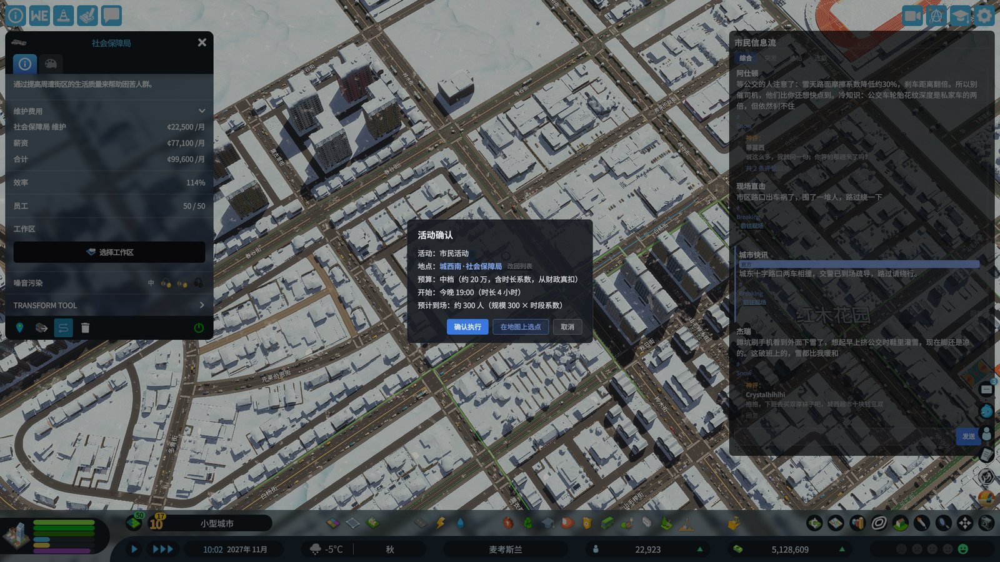
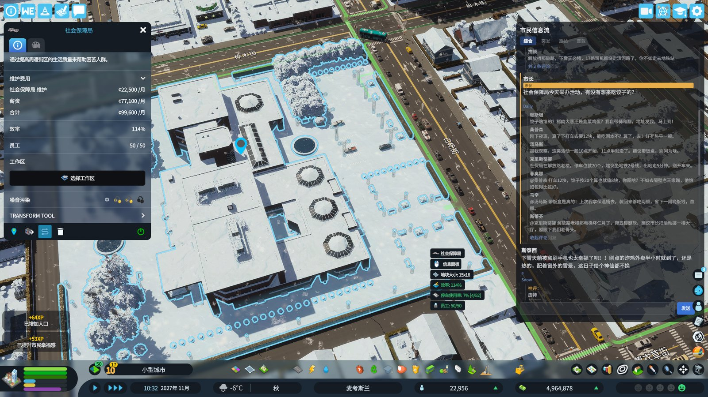

<div align="center">

# CityLife 市民圈

**让 Cities: Skylines II 的城市活起来。**

市民、商家、政府在虚拟社交平台上议论你的城市；你说的话，城市当真。

[](LICENSE)
[](https://www.paradoxinteractive.com/games/cities-skylines-ii/about)
[](https://dotnet.microsoft.com)
[](#当前状态与路线图)

[它会做什么](#它会做什么) · [路线图](#当前状态与路线图) · [架构](#架构要点) · [构建](#构建与本地部署) · [贡献](#贡献)



*实机画面：右侧为 mod 的「市民信息流」面板；中央的「活动确认」弹窗是市长活动链的一环——市长一句话变成一场真实活动：地点（社会保障局）、预算档位、预计到场约 300 人，确认后市民会真的聚集过去。*

</div>

> **当前状态：尚无公开可玩版本。** M0 技术验证已完成，功能原型推进中。现在 clone 下来得到的是一个开发中的原型，而不是成品 mod——下文标注了各项的落地进度。

## 为什么做这个

CS2 模拟了几万市民的通勤、工作与生活，但他们对市长的决策毫无反应：你加了税、修了新路、拆了半个老城区，城市里听不到任何回响。模拟是活的，城市是哑的。

LLM 第一次让「市民议论你的城市、你说的话被城市当真」成为可能——但前提是管住它的手。本项目的核心理念：**算得准的全给执行层（C#/ECS），LLM 只做它擅长的两件事**——把结构化上下文变成文本，把玩家自然语言变成结构化意图。LLM 的输出绝不直接改模拟数值，必须经 schema 校验与分档上限的确定性映射。

另一条底线是 **AI 忠于模拟**：内容锚定城市此刻真实的状态，治理得好主流是真夸，治理得烂才被骂上热搜；mod 不替换游戏原生个体 AI（市民的行程与行为属游戏侧），只改流量与叙事。

## 它会做什么



*实机画面：mod 的「市民信息流」面板——市民帖子锚定城市真实状态（降雪、公交绕行、道路结冰），互相评论抬杠；下方是市长发言区，从这里说的话会被城市当真。*

- **一座在议论你的城市**：LLM 驱动的虚拟社交平台替换原版 Chirper。市民、商家、政府部门发帖、评论、抬杠——内容锚定刚加的税、堵死的路、新开的店、昨晚那场雨。
- **放大城市，听到街头**：镜头拉近，行人头顶冒出闲聊，堵车时车主在车里骂街，住宅楼议论房租、办公楼吐槽加班。（气泡层为独立氛围层，实机验证中。）
- **你说话，城市当真**：以市长身份发帖，LLM 把意图解析为结构化事件——宣布烟花节，市民分批出发、道路真的堵起来、附近商家真的赚钱，第二天平台上全是现场讨论；碰上下雨就是另一番冷场剧本。做不到的事，城市会告诉你「做不到」，而不是假装执行了。
- **口碑可以经营**：景区被夸，外地游客真的会多起来；被吐槽宰客，游客真的会减少——旅游第一次变成可经营的玩法循环。
- **有记忆的城市**：事件当事人发声、一夜爆红的市民成为网红、持续活跃的网红成为有人格和记忆的「明星市民」，连续追踪大事件，形成你自己的城市连续剧。

每项的完整设计（含边界与降级预案）见[设计文档](docs/specs/2026-08-16-cs2-living-city-design.md)。

## 当前状态与路线图

M0 技术验证已于 2026-08-19 完成（Game.dll 元数据复核、CLI 链路 50 连发、TripNeeded 注入压测等，报告见 [docs/spikes/](docs/spikes/)）。功能原型推进中：信息流面板、市长活动链、民意请愿层已实机跑通；气泡层 v2 渲染管线已部署待验证。最新进展以 [docs/HANDOFF-2026-08-21.md](docs/HANDOFF-2026-08-21.md) 为准。

| 阶段 | 内容 | 状态 |
|---|---|---|
| M0 技术验证 | 工具链 / GameBridge 读侧 / CLI 链路 / IME / 注入压测 | ✅ 完成（2026-08-19） |
| M1 MVP | 模板兜底 + CLI 网关 + 一炉评论 + 发帖通道 | 🚧 进行中 |
| M2 自建信息流面板 | React 面板 + 板块 + 热搜 + 市长发帖框 | 🚧 进行中 |
| M3 气泡 overlay | 世界空间气泡，锚定市民/车辆/建筑 | 🚧 v2 实机验证中 |
| M4 市长事件链 | 事件包架构 + 原语执行器库 | 🚧 活动链已跑通（v4 决策提前于 M3） |
| M5 明星市民 | 人格 / 记忆 / 持久化 / 对骂剧本 | 未开始（v1 连续剧角色池已先行） |
| M6 发布 | MUTE 打磨、设置页、PDX Mods 上线 | 未开始 |

M0–M2 为最小可玩闭环。里程碑的验证标准与预估见设计文档 §9。

## 架构要点

完整架构决策（含铁律与踩坑记录）在设计文档与 [AGENTS.md](AGENTS.md)，这里是给读者的版本：

- **单向阀门**：LLM 输出经 schema 校验 + 分档有上限的确定性映射才落到模拟。写回强度四档可调（±5% 纯氛围到 ±30% 疯狂档），可完全关闭写回只留氛围。
- **版本敏感面收敛**：所有直接触碰游戏 API 的代码集中在 `GameBridge` 命名空间，其余模块只依赖其稳定接口——游戏版本升级时，需要复核的面是收敛的。
- **LLM 调用全 one-shot、后台异步**：所有调用经 `ICliProvider` 抽象在后台线程执行，队列/冷却/过期丢弃/重试/token 统计由网关统一管理，**绝不阻塞模拟线程**；游戏加速时自动降频停 AI；MUTE 一键停 AI。
- **双轨供给**：订阅制代码 CLI（首发支持 Kimi Code，社区可适配其他 CLI）或按 API 计费的 OpenAI 兼容端点，共用同一接口与缓存纪律（prompt 固定前缀 + 动态尾部，订阅制省额度、计费制直接省钱）。

### 模块布局

```
src/CityLife/
├── GameBridge/   # 版本敏感面集中层：ECS 读侧、事件检测、TripNeeded 注入、UI 数据桥
├── Content/      # 内容引擎：话题雷达、prompt 组装、人格卡、信息流仓库（FeedStore）
├── Llm/          # LLM 网关与供给抽象：ICliProvider / KimiCliProvider / OpenAiCompatibleProvider
└── UI/           # cohtml React 面板（webpack 构建）
tools/GameDllDump/  # Game.dll 元数据只读 dump（版本复核用）
scripts/            # 部署与 spike 实测脚本
docs/               # 设计文档、发布页文案、spike 报告、交接文档
```

## 构建与本地部署

**前置需求**：

- .NET SDK（8.0+；mod 目标框架为 `netstandard2.1`，与游戏程序集一致）
- Cities: Skylines II 本体（编译时引用游戏程序集，只引用不打包）
- Node.js 18+（仅构建 UI 面板时需要）

**编译**：

```bash
dotnet build src/CityLife/CityLife.csproj

# UI 面板（deploy.sh 只拷贝产物，不代为构建）：
cd src/CityLife/UI && npm install && npm run build
```

游戏路径解析顺序：MSBuild 属性 `Cities2Path` > 环境变量 `CITIES2_PATH` > 默认 `D:\SteamLibrary\steamapps\common\Cities Skylines II`。

**部署**：

```bash
./scripts/deploy.sh           # 编译（Debug）+ 复制到本地 Mods 目录
./scripts/deploy.sh -c Release
./scripts/deploy.sh disable   # 临时禁用（目录改名 .CityLife，游戏忽略点开头目录）
./scripts/deploy.sh enable    # 恢复
```

本地代码 mod = `Mods/CityLife/` 文件夹 + dll，游戏启动时自动加载，无需 playset 激活。

**验证**：Steam 启动选项加 `--developerMode`，进存档后查看 `%USERPROFILE%\AppData\LocalLow\Colossal Order\Cities Skylines II\Logs\CityLife.log`，出现 `[ReadProbe] 市民=N, 家庭=M` 即读侧链路打通。

## 贡献

项目按**社区优先原则**设计（设计文档 §1）：后期内容生态靠社区生长，代码注释与扩展点文档是一等交付物。三条主要贡献路径：

1. **CLI 适配**：实现 `ICliProvider` 接口（三个成员）即可接入新的 LLM 供给——其他 code CLI 或 API 计费端点。接入指南直接写在 [`src/CityLife/Llm/ICliProvider.cs`](src/CityLife/Llm/ICliProvider.cs) 文件头，现有 `KimiCliProvider` / `OpenAiCompatibleProvider` 两个实现可作范本。
2. **事件包**：JSON/YAML 数据文件，不写代码就能新增「市长发言 → 真实事件」的支持；格式随写回层稳定后公布。
3. **翻译**：内容输出语言随游戏语言，发布即中英，欢迎更多语言。

给 coding AI 与人类贡献者的工程规范（架构铁律、代码规范、踩坑记录）见 [AGENTS.md](AGENTS.md)。改动涉及设计决策时，先更新设计文档再写码。

## 文档

- [设计文档](docs/specs/2026-08-16-cs2-living-city-design.md)（唯一设计权威，含架构决策与里程碑）
- [发布页文案草案](docs/store-page-draft.md)
- [技术验证（spike）报告](docs/spikes/)
- [最新交接文档](docs/HANDOFF-2026-08-21.md)

## 许可证

MIT，见 [LICENSE](LICENSE)。
